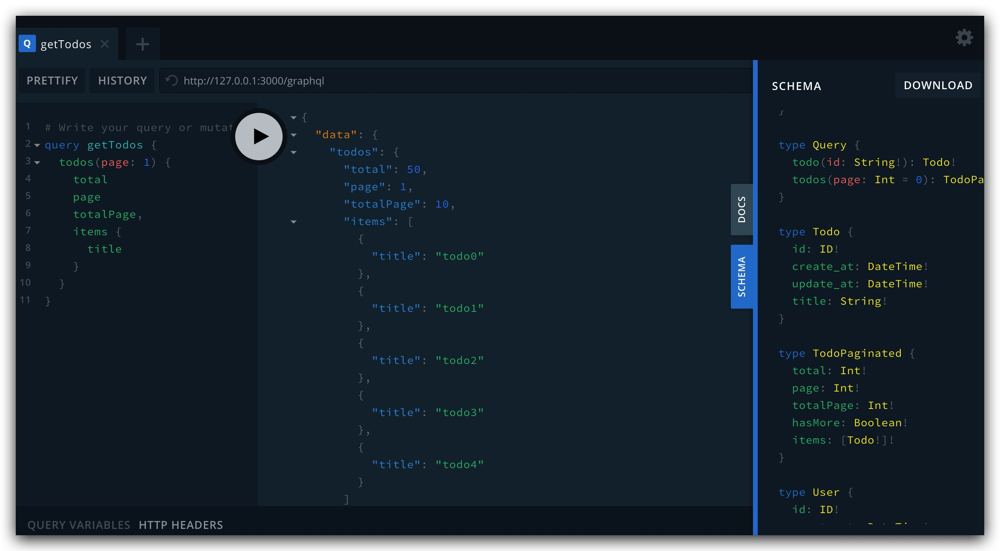
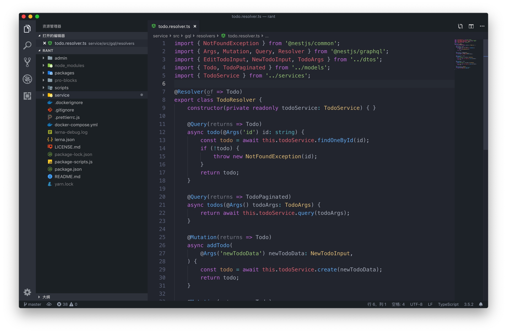

# RANT

Node.js Enterprise Development Template Project

## What is RANT?

- R: Ract Stack - Next.js、Ant Design ...
- A: Apollo Stack - Apollo Client、Apollo Server、Apollo Next ...
- N: Nest Stack - Nest.js ...
- T: Type Stack - TypeORM、TypeGraphQL ...

## Useage

```
$ yarn && yarn ic && yarn dev
```

## Preview

[](#)

[](#)